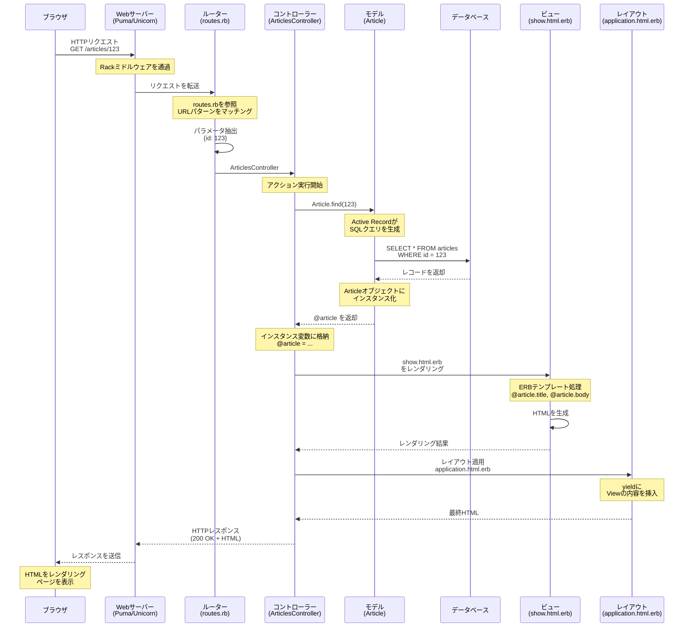

復習もかねて、MVCについてもう一度整理していきます。

## MVCの基本理念

MVCは、「関心の分離」という設計原則に基づいており、アプリーションを3つの責務に分けることで、コードの保守性と再利用性を向上させることが目的です。<br />
Modelはデータとビジネスロジック、Viewは表示、ControllerはModelとViewの橋渡し役という役割を担当します。

### 関心の分離

関心の分離は、プログラムを構成する各部分が、明確に定義された単一の責務を持ち、他の責務と混在しないようにするための設計手法です。一つのコードが複数の責務を持つと、変更が難しくなり、バクが発生しやすくなります。

例えば、記事を表示するコードを全て1つのファイルに詰め込んで書いたとしましょう。そこには、DB接続、SQLクエリ、HTML生成、CSSなどの全てが混在しています。このような場合、記事のタイトルの色だけ変更したいという要望が来た時に、どこを変更すれば良いのか分からなくなり、他の部分に影響を与えてしまう可能性があります。

## リクエストからレスポンスまでの流れ

### 1. リクエストの受信とルーティング

ユーザーがブラウザで `https://example.com/articles/123` にアクセスしたとします。このHTTPリクエストは、まずWebサーバー（PumaやUnicornなど）が受け取り、Railsアプリケーションに渡されます。

Railsが最初に行うのはルーティングです。このURLはどのコントローラーのどのアクションに振り分けるかを決定します。<br />
ここで重要なのは、ルーティングが単なるURLの解析以上の役割を果たしているという点です。RESTful設計を促進し、HTTPメソッドとURLパターンを組み合わせて、適切なアクションを特定します。

#### RESTful設計

RESTはRepresentational State Transferの略で、Webアーキテクチャの一つです。RESTは、HTTPプロトコルがもともと持っている特性を最大限に利用して、シンプルで拡張性の高いシステムを作ろうという考え方です。

【RESTが登場する前の問題】
初期のAPIは、URLの設計が一貫しておらず、`/getArticle?id=123` や `/createNewArticle` などのように、URL内に動詞が入ってしまっています。この場合、新しい機能を追加するたびに、新しいURLを考えなければならず、命名規則も統一されていませんでした。また、HTTPにはGET、POST、PUT、DELETEなどのメソッドが存在しますが、これらを適切に利用していませんでした。

【RESTの登場】
リソース指向という考え方に基づき、そのリソースに対して何をするかはHTTPメソッドで表現するようになりました。例えば、記事リソースに対しては以下のように操作します。

```
GET    /articles/123     # 記事を取得
POST   /articles         # 記事を新規作成
PUT    /articles/123     # 記事を更新
DELETE /articles/123     # 記事を削除
GET    /articles         # 記事の一覧を取得
```

### 2. コントローラーでの処理

ルーティングによって特定されたコントローラとアクションが実行されます。コントローラーの役割はリクエストを受け取り、適切な処理を行い、レスポンスの準備をすることです。

コントローラーは「薄く」保たれるべきで、ビジネスロジックはModelに移譲されるべきです。こうすることにより、テストのしやすさと再利用性を高めることができます。

### 3. モデルでの処理

コントローラー内でモデルが呼ばれると、ActiveRecordを通じてデータベースから必要なデータを取得することができます。<br />
Active Recordは、Rubyのオブジェクトとデータベースのテーブルをマッピングします。<br />
データベースから取得されたレコードは、Rubyのオブジェクトとしてインスタンス化されます。

Modelの責務はデータの永続化だけでなく、バリデーションや関連付け、複雑なビジネスロジックもここに配置されます。

### 4. インスタンス変数とViewへの受け渡し

コントローラーで `@article`のようなインスタンス変数に代入します。Railsでは、コントローラーのインスタンス変数が自動的にViewに渡される仕組みになっています。<br />
なぜ、インスタンス変数が自動的にViewに渡されるのかというと、コントローラーのアクションが実行された後、同じコントローラーインスタンスのコンテキストでViewがレンダリングされるため、インスタンス変数が共有されます。

### 5. Viewでのレンダリング

明示的な`render`呼び出しがない場合、Railsは規約に従って自動的に対応するViewテンプレートを探します。

### 6. レスポンスの送信

全てのレンダリングが完了すると、最終的なHTMLがHTTPレスポンスとしてクライアントに返されます。この時、ステータスコードやContent-Typeヘッダーなども送れます。

## 状態遷移図


